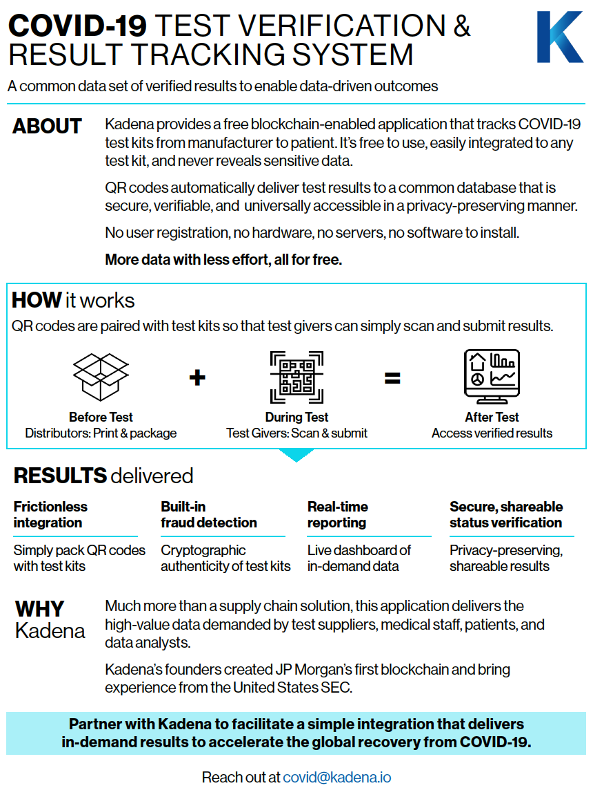

# COVID-19 Test Verification and Result Tracking System

## Overview

## Summary

This decentralized application (dApp) is composed of 2 parts
  1. “Test Supplier Portal” is where Test Suppliers generate the smart QR codes
  2. “Clinician / Patient Portal” is where Clinicians and Patients use the smart QR codes.

## Part 1: Using the Test Supplier Portal
  1. Go to the Test Label Dashboard, https://covid19-dashboard.chainweb.com/
  2. Fill in the required form fields
  3. Press “Sign” button to generate QR codes
  4. Open downloaded folder to print and pack individual QR codes with each test kit for distribution

## Part 2: Using the Clinician / Patient Portal

### Clinician (while administering a COVID test)
  1. Using a smart device, go to the Clinician / Patient Portal, https://covid19-test.chainweb.com/
  2. Select “Clinician” button
  3. Scan the QR code paired with the individual test kit
  4. Fill in the form fields to record patient info, then select the “Administer Test” button
  5. Upon success, provide the newly generated QR code to the patient. This will be their “receipt” to access their test results in the future
  6. When the patient’s actual test result is ready, then scan the original QR code paired with the test kit for a second time
  7. Select the patient’s test result from the form options, then select the “Post Test Result” button

### Patient (after taking a COVID test)
  1. Receive QR code “receipt” from clinician in order to access test result once posted
  2. Using a smart device, go to the Clinician / Patient Portal, https://covid19-test.chainweb.com/
  3. Select “Patient” button, then select “Scan New Test” button
  4. Scan the QR code provided to you to view your test results
